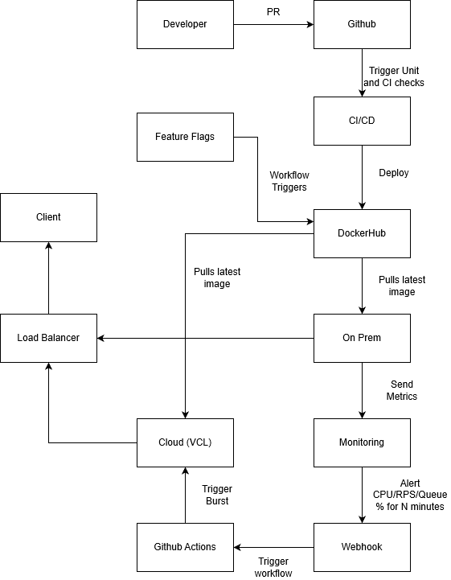

# CloudBurst — Automated DevOps Pipeline & CPU-Based Autoscaling System 

CloudBurst is an event-driven DevOps pipeline designed to deliver secure, reliable, and scalable deployment of containerized applications. The system runs workloads on standard, on-premise infrastructure but automatically “bursts” to the NCSU VCL Kubernetes cluster when CPU usage exceeds defined thresholds. Through a combination of CI/CD automation, Infrastructure-as-Code, real-time monitoring, and multi-layered security scanning, CloudBurst demonstrates a robust and production-grade DevOps workflow.

## 1. Overview

CloudBurst automates the entire software delivery lifecycle—from code linting and unit testing to deployment, monitoring, and autoscaling. The platform ensures that only tested, secure, and validated code reaches production, and integrates real-time CPU metrics to trigger replica scaling on the VCL cluster without manual intervention. This hybrid design allows on-premise resources to handle normal traffic while leveraging cloud resources during high-load events.

## 2. Architecture

The system integrates GitHub Actions, Docker Hub, Ansible-based provisioning, Prometheus monitoring, Alertmanager webhooks, and Kubernetes scaling actions.

### System Architecture Diagram

<p align="center">  </p>

## 3. Key Features

### **Automated CI Pipeline**
- **Linting:**  
  - Hadolint checks Dockerfiles  
  - Ansible-Lint validates Ansible playbooks  
- **Testing:**  
  - Node.js unit tests (`npm test`)  
- **Security:**  
  - `npm audit` for dependency vulnerability scanning  
  - CodeQL for static analysis and detecting insecure flows  
- **Dependency Maintenance:**  
  - Renovate bot automatically creates PRs for package updates  

---

### **Automated CD Pipeline**
- Multi-stage Docker builds for smaller, secure production images  
- Trivy scanning for OS-level vulnerabilities before image publishing  
- Docker image pushed to Docker Hub upon merging to `release/**`  

---

### **Infrastructure-as-Code**
- Ansible automates provisioning of self-hosted runners and on-prem environments  
- Ensures reproducible, consistent configurations across all deployment nodes  

---

### **Autoscaling with CPU Metrics**
- Prometheus continuously scrapes CPU metrics from pods  
- Alertmanager triggers a webhook when thresholds persist  
- Webhook sends a GitHub `repository_dispatch` event  
- `burst.yml` workflow scales replicas on the VCL Kubernetes cluster  

---

### **Security-Focused DevOps**
- SAST via CodeQL  
- SCA via `npm audit`  
- Dockerfile linting with Hadolint  
- Container and IaC scanning with Trivy  
- All secrets stored securely in GitHub Secrets  
- PAT scoped strictly to trigger the dispatch event (least privilege)  

---

## 4. Pipeline Flow

### **Developer Phase**
- Developers create feature branches  
- Branch protection prevents direct pushes to `main` or `release/**`  

---

### **Pull Request → CI**
Opening a PR triggers the full CI suite:
- Linting (Hadolint, Ansible-Lint)  
- Unit tests (`npm test`)  
- Security scans (npm audit, CodeQL)  
- Build validation  

---

### **Merge to Release → CD**
When changes are merged:
- Docker image built using a multi-stage build  
- Trivy scans for OS-level CVEs  
- Secure image pushed to Docker Hub  

---

### **Deployment**
- On-prem cluster automatically pulls the latest image  
- Load balancer routes incoming traffic across active replicas  

---

### **Monitoring**
- Prometheus scrapes CPU and RPS metrics  
- Alertmanager fires alerts based on defined rules  
- Webhook triggers GitHub Actions → `burst.yml` workflow  

---

### **Autoscaling**
- VCL Kubernetes cluster pulls the same image  
- Additional replicas deployed during high CPU load  
- Load balancer includes cloud replicas for traffic distribution  

---

### **Unburst**
- When CPU stabilizes, the `unburst.yml` workflow scales down replicas 

## 5. Repository Structure

```
CloudBurst/
├── ansible/
│   ├── ansible-playbook.yaml
│   └── hosts.ini
├── burst-webhook/
│   ├── Dockerfile
│   └── server.js
├── coffee-project-main/
│   ├── app.js
│   ├── Dockerfile
│   ├── feature-flags.json
│   ├── public/
│   ├── server.js
│   └── test/
├── .github/workflows/
│   ├── burst.yml
│   ├── ci-checks.yml
│   ├── codeql-analysis.yml
│   ├── docker-push.yml
│   ├── hadolint.yml
│   ├── release-lint-ansible.yaml
│   ├── renovate.yml
│   ├── toggle-feature-flag.yml
│   └── unburst.yml
├── alertmanager-config.yaml
├── cloudburst.yaml
├── burst-webhook.yaml
├── cloudburst-prometheus-rules.yaml
├── alertmanager-cloudburst-config.yaml
├── media/
│   └── cloudburst_architecture.png
├── javascript.sarif
└── README.md
```

## 6. Running Locally

```
cd coffee-project-main
npm install
npm start
```

### Unit Tests
```
npm test
```

### Docker Build
```
docker build -t cloudburst-app .
```

## 7. Deploying to Kubernetes (VCL)

Apply base deployment and monitoring rules

```
kubectl apply -f cloudburst.yaml
kubectl apply -f burst-webhook.yaml
kubectl apply -f cloudburst-prometheus-rules.yaml
kubectl apply -f alertmanager-cloudburst-config.yaml
```

## 8. Provisioning with Ansible

```
ansible-playbook -i ansible/hosts.ini ansible/ansible-playbook.yaml
```

## 9. Security Components

- CodeQL static analysis
- npm audit for supply-chain vulnerabilities
- Hadolint for Dockerfile best practices
- Trivy image scanning in the CD workflow
- All tokens and configs stored in GitHub Secrets
- Webhook PAT restricted to repository dispatch only

## 10. Future Enhancements

- Integrating a message queue (RabbitMQ / Kafka) instead of direct webhooks
- Adding richer Grafana dashboards (latency, restarts, network throughput)
- Implementing Horizontal Pod Autoscaling (HPA) with custom metrics
- Deploying burst-webhook as a serverless function for lower overhead

## 11. 👥 Team Members
- **Smeet Nagda snagda**
- **Jinish Shah jrshah6**
- **Nisarg Jasani nhjasani**

## 12. License
Academic use for CSC 519 — DevOps at NC State University.